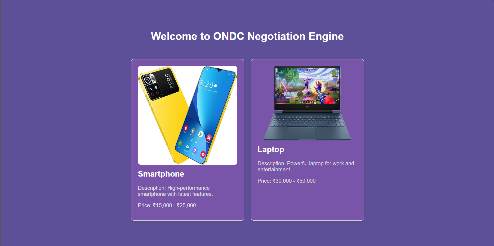
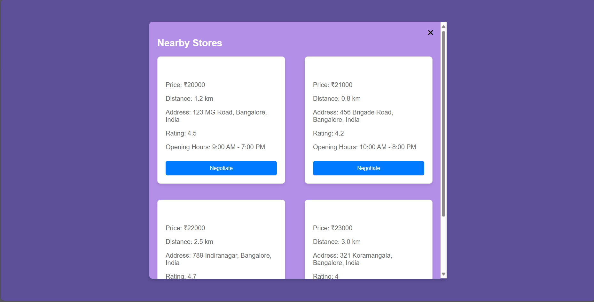
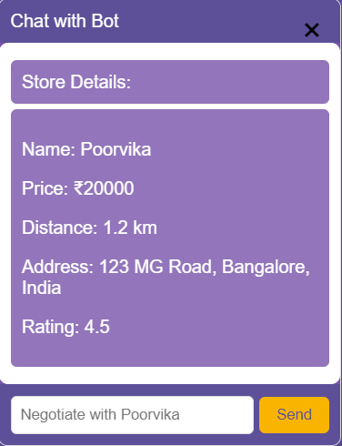

# ONDC Negotiation Engine

The ONDC Negotiation Engine is a web application that leverages the Open Network for Digital Commerce (ONDC) platform to facilitate negotiation between buyers and sellers. The project allows users to compare prices from nearby stores and initiate negotiations with sellers through a chat interface.

## About ONDC

The Open Network for Digital Commerce (ONDC) is an initiative by the Government of India aimed at creating a unified digital commerce platform to enable small traders, farmers, and businesses to participate in e-commerce. ONDC provides APIs and infrastructure to enable various stakeholders to build innovative solutions for digital commerce.

## How the Project Uses ONDC

The ONDC Negotiation Engine integrates with the ONDC platform in the following ways:

1. **Fetching Nearby Store Prices**: The project fetches price data from nearby stores using the ONDC APIs. This allows users to compare prices for products across multiple sellers in their vicinity.

2. **Initiating Negotiations**: Users can initiate negotiations with sellers through the chat interface provided by the ONDC Negotiation Engine. The chat interface facilitates real-time communication between buyers and sellers, enabling them to discuss pricing and other terms.

3. **Integrating Seller Information**: The project retrieves seller information from the ONDC platform, including store names, addresses, ratings, and opening hours. This information is displayed to users to help them make informed decisions when negotiating with sellers.

## Installation

No installation is required. Simply open the `index.html` file in a web browser to run the ONDC Negotiation Engine.

## Usage

1. Open the `index.html` file in a web browser.
2. Click on a product card to view nearby stores and their prices.
3. Click on the "Negotiate" button to initiate a chat with a seller and negotiate the price.
4. Enter your message in the chat input and click "Send" to negotiate with the seller.
5. Close the chat popup when finished.

## Demo

## Contributing

Contributions are welcome! Please fork the repository, make your changes, and submit a pull request.

## Credits

- Icons made by [Freepik](https://www.freepik.com) from [Flaticon](https://www.flaticon.com/)
- Product images from [Ubuy](https://www.ubuy.co.in/) and [APJOnline](https://www.apjonline.com/)

## License

This project is licensed under the MIT License - see the [LICENSE](LICENSE) file for details.
